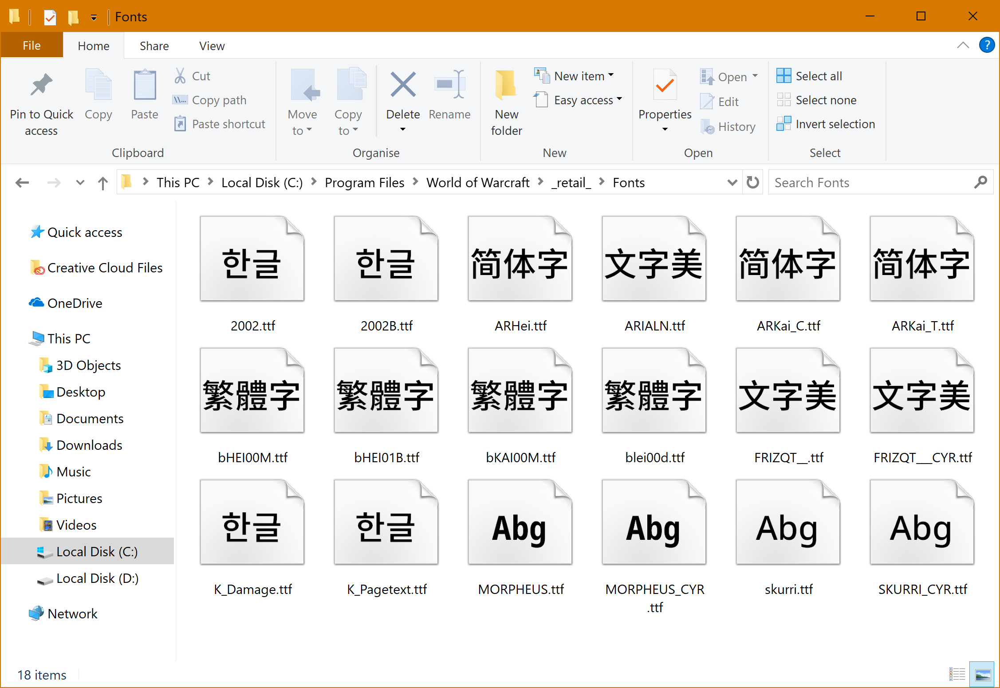
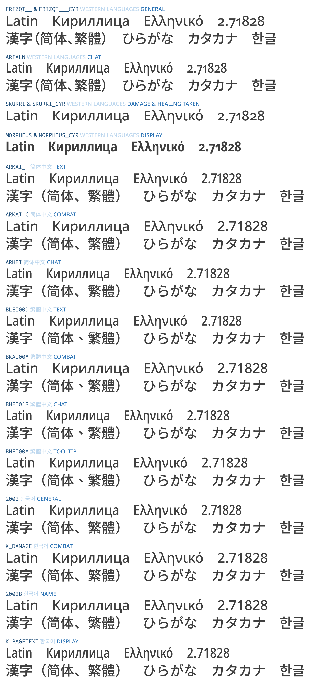

**English** [简体中文](README-Hans.md) [繁體中文](README-Hant.md)

# Nowar Sans for _World of Warcraft_

This is Nowar Sans, font packs for _World of Warcraft_ that support all languages. Nowar Sans is based on [Noto Sans](https://github.com/googlei18n/noto-fonts) and [Source Han Sans](https://github.com/adobe-fonts/source-han-sans).

> Make Love, Not Warcraft. 
> 要有爱，不要魔兽争霸。 
> 要愛，不要魔獸。

## Download the Fonts

[Latest release](https://github.com/CyanoHao/Nowar-Sans/releases)

Nowar Sans is shipped in 4 weights and 6 regional variants.

### Weights

* L: Light
* R: Regular
* M: Medium
* B: Bold
* [Morpheus (Western title font) may be bolder or lighter.]

### Regional Variants

Orthographies for each variant and client language are listed below.

|     | European                      | 简体中文       | 繁體中文  | 한국어  |
| --- | ----------------------------- | -------------- | --------- | ------- |
| CN  | Mainland China (UI)           | Mainland China | Taiwan    | Classic |
| TW  | Taiwan (UI)                   | Mainland China | Taiwan    | Classic |
| HK  | Hong Kong (UI)                | Mainland China | Hong Kong | Classic |
| JP  | Japan (UI)                    | Mainland China | Taiwan    | Classic |
| CL  | Classic (UI)                  | Classic        | Classic   | Classic |
| OSF | Classic (UI, Oldstyle Figure) | Classic        | Classic   | Classic |

* European: English, Español (AL), Português, Deutsch, Español (EU), Français, Italiano, and Русский.
* UI: Ambiguous punctations are treated as Western; CJK puctations are half-width; Kana are proportional.

### SharedMedia Font Provider

Nowar Sans is also avialable as an addon (REALLY HUGE!), to register Nowar Sans typeface to SharedMedia.

## Supported Scripts

## How to Build

Dependencies: Python and [otfcc](https://github.com/caryll/otfcc).

Put Source Han Sans OTF files to `shs/`, then just `make` it.

## Credit

Latin, Greek and Cyrillic characters are from [Noto Sans](https://github.com/googlei18n/noto-fonts) by Google.

CJK Ideographs, Kana and Hangul are from [Source Han Sans](https://github.com/adobe-fonts/source-han-sans) by Adobe.
